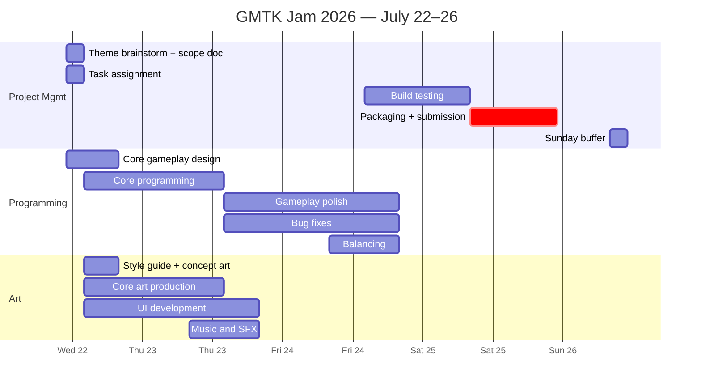

# Schedule — GMTK Jam 2026

**Jam window:** Wednesday July 22 – Sunday July 26.
**Hard deadline:** Sunday July 26, 11:00 AM.
**Internal target:** submit-ready by **Saturday July 25 evening** — Sunday morning is buffer, not work time.

> Speculative only — goals flex based on ability and motivation. (Kyle's original note, kept because it's correct.)

## Daily Goals

| Day | Goal |
|-----|------|
| Wed 22 | **Playable prototype** by end of day |
| Thu 23 | **Feature complete** |
| Fri 24 | **Game essentially finished** — polish and balance only |
| Sat 25 | **Submit-ready build** — final fixes, export, itch.io page, media |
| Sun 26 | Buffer. Sleep. Submit confirmation before 11 AM if not already in. |

## Gantt

*Bar lengths span working windows, not literal continuous hours — nobody is programming at 3 AM. See daily blocks below for actual hours.*

## Daily Blocks

### Wednesday, July 22 — GOAL: Playable prototype

**11 AM – 2 PM (everyone):** Theme reveal, brainstorm, define MVP, scope document (fill in `GDD.md`), break down responsibilities.

**2 PM – 8 PM:**
- **Yuki:** player controller, core gameplay system, game loop
- **Marina:** style guide, concept art, first production assets
- **Kyle:** UI mockups, menus, supporting art (following Marina's style guide)
- **Mike:** assist programming, assist art pipeline, technical setup

### Thursday, July 23 — GOAL: Feature complete

**8 AM – 2 PM:** finish missing mechanics, produce remaining assets, continue UI, add sound.
**2 PM – 8 PM** *(class 4–7 PM)*: begin polish, improve feel, playtest, begin balancing.

### Friday, July 24 — GOAL: Game essentially finished

**8 AM – 2 PM:** polish gameplay, improve visuals, tune difficulty, particles (if time), improve UI.
**2 PM – 8 PM:** heavy playtesting, bug fixes, final balancing, prepare release.

### Saturday, July 25 — GOAL: Submit-ready

**8 AM – 11 PM:** final bug fixes only, test builds (Windows AND WebGL), export, fill out itch.io submission page, record gameplay + screenshots. **Aim to actually submit tonight.**

### Sunday, July 26 — Buffer

Deadline 11 AM. If Saturday went to plan, this is a formality. If not, this is triage time — cut, don't add.

## Standing Rules

- Playable prototype Wednesday night is the hill to die on. Everything else flexes.
- Feature freeze Friday 2 PM. After that: polish, fixes, balance. No new mechanics.
- First full build export happens **Friday**, not Saturday. Build problems found Saturday night are how jams are lost.
- Check the itch.io jam page for submission requirements (build format, screenshots, description) on Wednesday, not Saturday.
